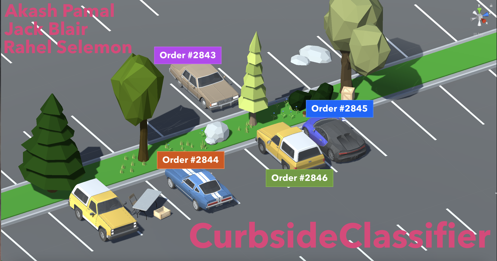
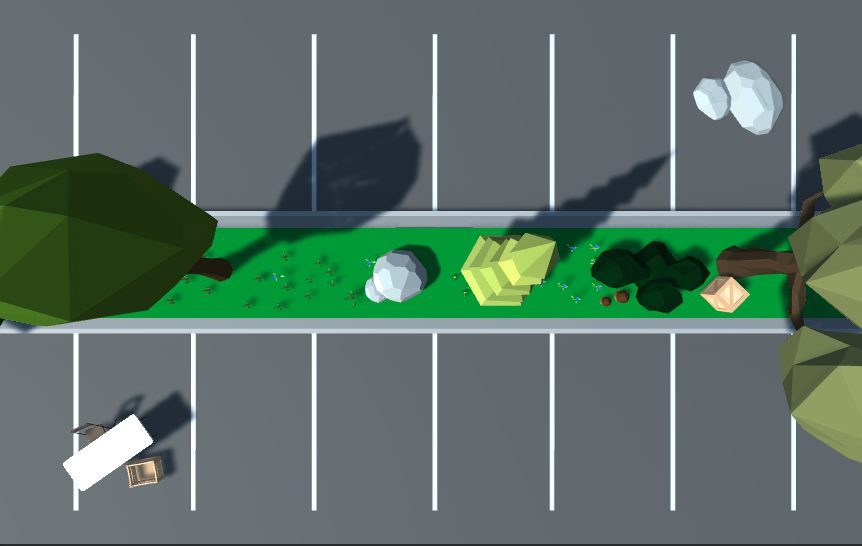

# CurbsideClassifier

## Inspiration

We've all heard of contactless delivery and curbside pickup due to COVID-19, but we still don't realize how unoptimized this process is. Many businesses are forced to send out employees, who search for cars in the lot. Customers usually have to use apps to notify employees within the store. This whole process is inefficient, which is why we've developed an autonomous solution to make the experience more comfortable, efficient, and successful for employees as well as customers.

## What it does

Our software automatically recognizes cars as they enter the lot without need for any customer intervention. It uses image recognition to identify the car and match it with the order that was placed online. Then, it automatically notifies employees inside the store with the order number and exact location of the car.

## Development

Since it wasn't realistic for us to spend hours at a parking lot collecting data, we simulated our complete parking lot using the Unity Game Engine. We were able to generate several cars in random positions, and save screenshots as well as a json of the list of cars to generate our training data. To keep this model as close as possible to the real world, we even added trees and other obstructions on the parking lot. Then we used this data to train a Keras model.

This model learned how to classify the type of car in a single parking space, and also learned to detect if the parking space was empty. After we identified the vehicle and matched it with the order number, we used the Google Sheets API to display this information to the employees inside the store. During this whole process, neither party has to pick up a phone or press any buttons – it's all intelligently automated and integrated by our system.

## Challenges We Encountered

While developing this project, we ran into a couple of challenges. First, we encountered the steep learning curve of scripting with Unity, which we hadn't really used before. Within Unity, we had to learn how to capture and save screenshots of the current camera view within Unity.

Although the Tensorflow image recognition itself was relatively straightforward, we encountered some challenges with preprocessing the data for Tensorflow to use. To prepare the data for the tensorflow neural network, we first needed to extract important information from our raw images by splitting up the parking lot into individual parking spaces.

## Accomplishments

We were able to accomplish a great deal with our project. Our neural network was able to identify which order was in which spot with 100% accuracy for over 3000 samples. We even tested our NN with images where the cars were parked poorly (parking on the line or onto the median) and it was still able to identify with 97%. With small tweaks, we are confident that this could actually be deployed at a business and help with curbside pickup management. 

## What we learned

This project really took us out of our comfort zone is terms of concepts and content. We had never properly used Unity to create a 3D scene, or even written code in C#, so we spent many hours debugging and looking up tutorials. On the neural network side of things, we had very little experience using Keras, so we learned a lot as we used it for our project. On the frontend side of things, we learned how to use the Google Sheets API to send data to a Google Sheet, which can then be displayed anywhere.

## Deployment of CurbsideClassifier

We hope to eventually train our model using actual parking lot images, which means more cars, more variation in types, colors, and sizes, and different weather scenarios/light patterns. Since there would be more variation in our data, we may need to train our model with even more samples to have it attain a similar accuracy.

One future challenge we might face is if two cars of similar models and colors arrived in the lot at the same time. To help with this, we could also use features like license plate detection to distinguish the vehicles. Other than that, this technology could realistically be deployed and used for businesses of all scales.

